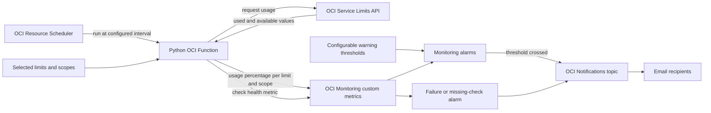

# Proposed limit-warning flow

This diagram shows the current **proposed** design for the first workstream. Phase 1 of [PROJECT_PLAN.md](PROJECT_PLAN.md) will confirm the exact limits and whether Monitoring alarms are the right email path.

The warning threshold triggers an email; it does not change the OCI hard limit. A selected limit that lacks usable Service Limits data needs a validated alternative before it can be monitored. IAM policy counts are planned for phase 3 using a separate counting method if needed.

Cloud Guard findings are a separate workstream in phases 4 and 5. Their flow will be documented after their scope is agreed.
